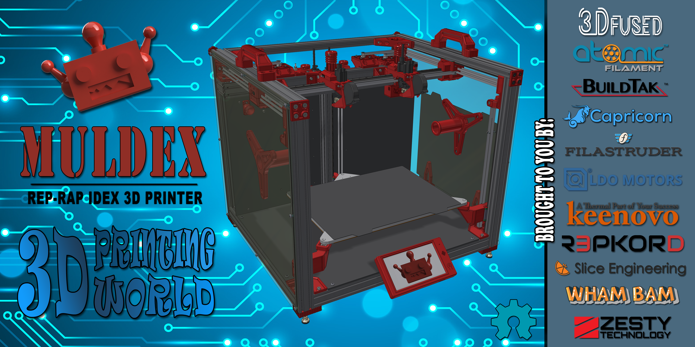

# Muldex
Opensource IDEX REP-RAP 3D Printer
MULDEX
3D PRINTER
### Print Volume:
Single Mode: 365mm x 300mm x 300mm 
Copy Mode: 180mm x 300mm x 300mm 
Dual Extruder: 330mm x 300mm x 300mm
### Build Platform: 
300mm X 400mm  
120v Silicone heater  
8mm Mic 6 Aluminum Plate 
Kinematic Coupled Bed 
Independent motor leveled bed 
Flex Plate System 
### Kinematics: 
X-Y-U Axis: Dual Markforged  
Z-Axis: Belted 9mm Planetary Steppers 
12 and 9mm Sq. Rail Bearings 
Controller: Duet 2/Panel Due i7/Duex 5 
Frame: 4020 & 2020 Extruded Aluminum 
### Componets: 
Independently Adjustable Nozzle Height 
Remote Direct Drive Extruders 
Purge Bucket/Ooze guards 
Reverse Bowden w/filament runout 

Facebook:[Muldex User Group](https://www.facebook.com/groups/961386687613469)

### Links:
Jig's for drilling the holes in the extrusions can be found here:[ Guillaume Gendron's Drilling Jigs](https://www.prusaprinters.org/prints/32532-drilling-jigs-for-2020-and-2040-extrusions?fbclid=IwAR0py0DBZHolj00tUQ7sBJJz-VRNig2q1UsV53dtzBp9e5wvFwZq9592s_k) 

### Sponsers:
[3D Fused](https://www.3dfused.com) 
[Atomic Filament](https://www.atomicfilament.com) 
[Buildtak](https://www.buildtak.com) 
[Capricorn](https://www.captubes.com) 
[Filastruder](https://www.filastruder.com) 
[LDO Motors](https://www.ldomotors.com) 
[Keenovo](https://keenovo.store/.com) 
[Repkord](https://www.repkord.com) 
[Slice Engineering](https://www.sliceengineering.com) 
[Wham Bam](https://www.whambamsystems.com) 
[Zesty Tech](https://zesty.tech/) 

### Known Issues:
1. Firmware not yet finalized
  
